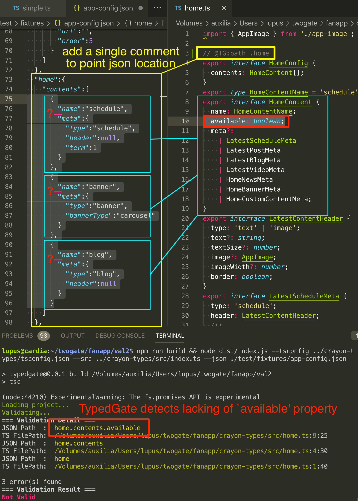

TypedGate - a JSON Type Checker & Validator without schemas
===========================================================
TypedGate is a JSON checker & validator tool without using any schemas but **only requires typescript interface definitions and simple comments**.

TypedGate compares typescript interface/class definition to JSON then output validation results.



## Installation
### Try now without installation (npx)
You can use npx to use TypedGate without installation:

```bash
npx typedgate --tsconfig ./tsconfig.json --src ./src/index.ts --json ./some-json-file.json
```

### Global installation
```bash
npm install -g typedgate
```

```bash
typedgate --tsconfig ./tsconfig.json --src ./src/index.ts --json ./some-json-file.json
```

## Checking your TypeScript codes of Interfaces / Classes with TypedGate
### Add ControlComment to your Interface/Class definitions

In this example, control-comment `@TG:path .engine` is added to `Engine` interface.
TypedGate recognize that JSON's `engine` property should follow `Engine` interface.

```typescript
export type CylinderLayout = 'inline' | 'flat' | 'v';
export type FuelSystemKind = 'injection' | 'carburetor';
export type EngineDirection = 'longitudinal' | 'transverse';

// This is a control comment
// @TG:path .engine
export interface Engine {
  name: string
  displacement: number;
  bore: number;
  stroke: number;
  compressionRatio: number;
  turbo: boolean;
  intercooler: boolean;
  fuelSystem: FuelSystemKind;
  vvt: boolean;
  cylinderCount: number;
  rotary: boolean;
  diesel: boolean;
  cylinderLayout: CylinderLayout;
  engineDirection: EngineDirection;
  ignitionPlugName?: string;
}
```

Note that control-comments should be placed above the interface/class declaration.

TypedGate compares `Engine` interface to following json:

```json
{
  "engine": {
    "name": "1KZ",
    "displacement": 2982,
    "bore": 96,
    "stroke": 103,
    "compressionRatio": 21.2,
    "turbo": true,
    "intercooler": false,
    "fuelSystem": "injection",
    "vvt": false,
    "cylinderCount": 4,
    "rotary": false,
    "diesel": true,
    "cylinderLayout": "inline",
    "engineDirection": "longitudinal"
  }
}
```

Since this JSON has valid type of `Engine` interface, TypedGate will print following output:

```
Loading project...
Validating...
=== Validation Result ===
Valid
```

TypedGate also recognize multiple control-comment like this:

```typescript
// @TG:path .login.providers.twitter
// @TG:path .login.providers.facebook
// @TG:path .login.providers.line
export interface ProviderItem {
  displayName: string;
  isShow: boolean;
}
```

JSON shown below satisfies above interface definition.

```json
{
  "login":{
    "providers":{
      "twitter":{
        "displayName":"Twitter",
        "isShow":true
      },
      "facebook":{
        "displayName":"Facebook",
        "isShow":false
      },
      "line":{
        "displayName":"LINE",
        "isShow":true
      }
    }
  }
}
```

### Run TypedGate

To run TypedGate, you should specify path to project's tsconfig.json, path to source file, path to json to validate.

- `-t` or `--tsconfig`: path to `tsconfig.json`
- `-s` or `--src`: path to source file to validate
- `-j` or `--json`: path to json file to validate
    - Since TypedGate is not a JSON validator, JSON with wrong syntax will cause application error.
- `-v` or `--verbose`: TypedGate will print verbose outputs

```
typedgate --tsconfig ./test/fixtures/car-types/tsconfig.json --src ./test/fixtures/car-types/engine.ts --json ./test/fixtures/car-types/engine.json
```

(You can use `npx` without installation as described in 'Installation' section)

TypedGate will exit with code 0 when validation is success. Exit code 1 will be returned when validation failure.

## Hint
### Validating multiple files
`--src` option can be take one single file. To validate multiple files, we recommend that you put a file like this:

```typescript
export * from './color-theme';
export * from './general';
export * from './advanced';
export * from './tabs';
// other exports ...
```

We assume this file is named `src/index.ts`. To validate these exported files, you can run this command:

```
typedgate --tsconfig path/to/tsconfig.json --src ./src/index.ts --json /path/to/something.json
```

### Array path
Assume a JSON of array like this:

```json
[
  {
    "num": 123,
  },
  {
    "num": 321,
  },
  {
    "num": 987,
  },
  {
    "num": 456,
  }
]
```

An array is represented as `[]` in TypedGate. So below interface and ControlComment can validate above JSON.

```typescript
// @TG:path .[]
export interface ArrayInterface {
  num: number;
}
```

An array in object like this:

```json
{
  "array":
    [
      {
        "num": 123,
      },
      {
        "num": 321,
      }
    ]
}
```

is represented as:

```typescript
// @TG:path .array[]
export interface ArrayInterface {
  num: number;
}
```

## API
You can use TypedGate in your Node program.

```sh
npm install typedgate
```

```typescript
import { TypedGate, TypedGateResult } from '../src/index'

const tg = new TypedGate('./path/to/tsconfig.json', './path/to/project/index.ts')
tg.validateJsonFile('./test/fixtures/crayon-types/crayon-type.json').then((isValid: boolean) => {
  if (isValid) {
    console.log('Valid JSON & TypeScript combination')
  } else {
    const resultDetail: TypedGateResult[] | undefined = tg.validationResult
    // validation fails:
    // validationResult property contains detail of errors
    console.log('Not valid JSON & TypeScript combination')
    console.log(resultDetail)
  }
})

// You can also pass object directly rather than pass file path to JSON.
const object = {
  "some object": {
    // ...
  }
}
tg.validateObject(object).then(/*...*/)
```

Below is an example of failed validation.

`TypedGate.validationResult` property contains source file name of typescript, position where error occurs, etc.

```typescript
[
  {
    objectPathIdentifier: [ 'home', 'contents', 'available' ],
    objectValue: undefined,
    sourceFileName: '/path/to/project/test/fixtures/crayon-types/home.ts',
    text: 'available: boolean;',
    sourceFilePos: { line: 9, column: 25 },
    valid: false
  },
  {
    objectPathIdentifier: [ 'home', 'contents' ],
    objectValue: [ [Object], [Object], [Object] ],
    sourceFileName: '/path/to/project/test/fixtures/crayon-types/home.ts',
    text: 'contents: HomeContent[];',
    sourceFilePos: { line: 4, column: 30 },
    valid: false
  },
  {
    objectPathIdentifier: [ 'home' ],
    objectValue: { contents: [Array] },
    sourceFileName: '/path/to/project/test/fixtures/crayon-types/home.ts',
    text: 'export interface HomeConfig {\n  contents: HomeContent[];\n}',
    sourceFilePos: { line: 1, column: 40 },
    valid: false
  }
]
```

### Methods & Properties
- `constructor(private tsConfigFilePath: string, private sourceFilePath: string)`
    - `tsConfigFilePath`: path to `tsconfig.json`
    - `sourceFilePath`: path to typescript source file (e.g. project's root `index.ts`)
- `validateJsonFile(fileName: string)`
    - `fileName`: full path to JSON file to validate
- `validateObject(targetData: any): boolean`
    - `targetData`: object to validate (rather than pass file path to JSON by using `validateJsonFile()`.)
- `get validationResult: TypedGateResult[] | undefined`
    - `objectPathIdentifier`: indicates location of failed object
    - `objectValue`: `objectPathIdentifier`'s value
    - `sourceFileName`: path to TypeScript source code where validation failed
    - `text`: TypeScript source raw text that validation failed
    - `sourceFilePos`: position of failed TypeScript source code
    - `valid`: whether validation success or failed

## Development
### Run TypedGate
In `test/` directory, you can find various useful test cases to develop the TypedGate code.

```
npm run build && node dist/cli.js -v --tsconfig ./test/fixtures/car-types/tsconfig.json --src ./test/fixtures/car-types/engine.ts --json ./test/fixtures/car-types/engine.json
```

`-v` (`--verbose`) switch will help your development.

### Run tests
```
npm run test
```
